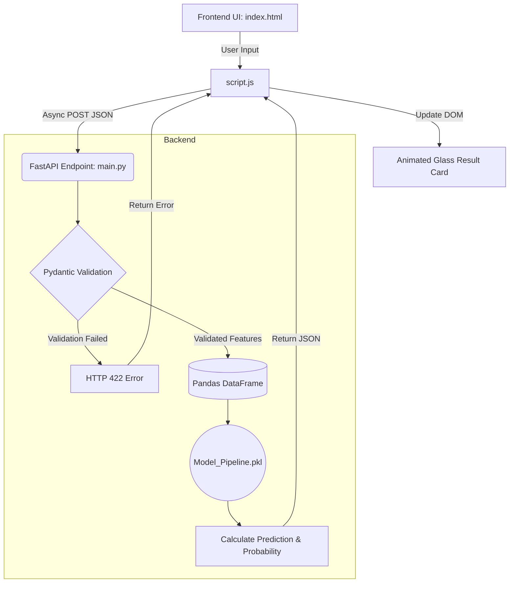

# Airbnb Room Type Predictor 🏙️✨

A stunning, interactive web application that leverages a Machine Learning pipeline to predict the room type of an Airbnb listing in New York City based on its features (price, location, minimum nights, reviews, etc.).

## 🎨 Features
- **Machine Learning Integration**: Powered by a pre-trained scikit-learn model (`Model_Pipeline.pkl`).
- **Liquid Glassmorphism UI**: Features a beautiful dark theme with a frosted glass panel, animated liquid gradients, and floating input labels.
- **Mouse-Tracking Reflections**: The glass card actively reacts to the user's cursor position.
- **Interactive Animations**: Includes a liquid-fill submit button and a 3D pop-up result card with a glowing "AI Certainty Score" progress bar.
- **Robust Validation**: Uses Pydantic on the backend to enforce strict data types and valid value ranges.

---

## ⚙️ Tech Stack
- **Backend:** FastAPI (Python), Uvicorn, Pydantic
- **Machine Learning:** Scikit-Learn, Pandas, Joblib
- **Frontend:** HTML5, Vanilla CSS3, Vanilla JavaScript

---

## 🔄 Application Workflow

Below is the architecture and data workflow for this project:



1. **User Input**: The user enters listing parameters (e.g., Latitude, Price, Minimum Nights, Borough) into the frontend glass form.
2. **Data Formatting**: The frontend `script.js` intercepts the form submission, prevents default reloading, parses the inputs into correct data types (integers, floats, strings), and builds a JSON payload.
3. **API Request**: The frontend sends an asynchronous `POST` request to the FastAPI endpoint (`/predict`).
4. **Data Validation**: FastAPI intercepts the request and passes the JSON data through a Pydantic `Feature` model. If any data falls outside expected bounds (e.g., negative price), FastAPI instantly returns a 422 Error.
5. **Model Inference**: If validation passes, the data is converted into a Pandas DataFrame and fed into the loaded `Model_Pipeline.pkl`. The scikit-learn model calculates the predicted category (e.g., "Private Room") and the probability array.
6. **Response & Display**: The backend returns the prediction and max probability to the frontend. `script.js` parses the response and animates the 3D result pop-up, adjusting the glowing AI Certainty Score bar to match the prediction confidence.

---

## 🚀 How to Run Locally

### 1. Install Dependencies
Make sure you have Python 3 installed. Then, install the required packages:
```bash
pip install -r requirements.txt
```

### 2. Start the Server
Run the FastAPI application using Uvicorn:
```bash
uvicorn main:app --reload
```

### 3. View the Application
Open your web browser and navigate to:
```
http://127.0.0.1:8000/
```
*(FastAPI is configured to serve the `index.html`, `style.css`, `script.js`, and background images directly from the root URL).*

---

## 📁 Project Structure
- `main.py` - The FastAPI server and prediction endpoint.
- `index.html` - The semantic HTML structure for the web app.
- `style.css` - The liquid glassmorphism styles and animations.
- `script.js` - Client-side form handling and API communication.
- `requirements.txt` - Python dependencies.
- `Model_Pipeline.pkl` - The trained machine learning model.
- `newyork.jpeg` - The beautiful NYC background image.

